# Agent Design Patterns Summary

Hello! This is a comprehensive guide to agentic AI system architectures based on various sources, including Google Cloud documentation, OpenAI documentation, Claude documentation, ADK (Agent Development Kit), and Antonio Gulli's book "Agentic Design Patterns: A Hands-On Guide to Building Intelligent Systems".

Enjoy!

## 🛠️ Implementation Guides

| Provider | Guide |
|----------|-------|
|  | [**claude-agent-patterns.md**](./claude-agent-patterns.md) |
|  | [**claude-sdk-agent-patterns.md**](./claude-sdk-agent-patterns.md) |
|  | [**openai-agent-patterns.md**](./openai-agent-patterns.md) |
|  | [**gemini-agent-patterns.md**](./gemini-agent-patterns.md) |
|  | [**google-adk-agent-patterns.md**](./google-adk-agent-patterns.md) |

---

## Table of Contents

1. [Single-Agent System](#1-single-agent-system)
2. [Sequential Pipeline Pattern](#2-sequential-pipeline-pattern)
3. [Parallel Fan-Out/Gather Pattern](#3-parallel-fan-outgather-pattern)
4. [Coordinator/Dispatcher Pattern](#4-coordinatordispatcher-pattern)
5. [Hierarchical Task Decomposition Pattern](#5-hierarchical-task-decomposition-pattern)
6. [Loop Pattern](#6-loop-pattern)
7. [Generator & Critic Pattern](#7-generator--critic-pattern)
8. [Iterative Refinement Pattern](#8-iterative-refinement-pattern)
9. [Human-in-the-Loop Pattern](#9-human-in-the-loop-pattern)
10. [ReAct Pattern](#10-react-pattern)
11. [Swarm Pattern](#11-swarm-pattern)
12. [Prompt Chaining Pattern](#12-prompt-chaining-pattern)
13. [Routing Pattern](#13-routing-pattern)
14. [Reflection Pattern](#14-reflection-pattern)
15. [Tool Use Pattern](#15-tool-use-pattern)
16. [Orchestrator-Workers Pattern](#16-orchestrator-workers-pattern)
17. [Memory Management Pattern](#17-memory-management-pattern)
18. [RAG (Knowledge Retrieval) Pattern](#18-rag-knowledge-retrieval-pattern)
19. [Guardrails/Safety Pattern](#19-guardrailssafety-pattern)
20. [Pattern Selection Guide](#pattern-selection-guide)

---

## 1. Single-Agent System

A single agent with an AI model, tools, and comprehensive system prompt handles the entire workflow autonomously.

### Architecture

```mermaid
flowchart TB
    subgraph AGENT["🤖 SINGLE AGENT"]
        direction TB
        SP["📋 System Prompt<br/>(persona, task, tool conditions)"]
        MODEL["🧠 AI Model<br/>(reasoning & planning)"]
        subgraph TOOLS["🔧 Tools"]
            TA["Tool A"]
            TB["Tool B"]
            TC["Tool C"]
        end
        SP --> MODEL
        MODEL --> TA
        MODEL --> TB
        MODEL --> TC
    end
    
    USER["👤 User Request"] --> AGENT
    AGENT --> RESPONSE["📤 Response"]
```

### Visual Graph (DAG)

```
┌──────────┐      ┌────────────────┐      ┌──────────┐
│ 👤 User  │ ───▶ │ 🤖 Single Agent│ ───▶ │ 📤 Output│
└──────────┘      └────────────────┘      └──────────┘
```


### Use Cases
- Multi-step tasks requiring external data access
- Prototyping and proof of concepts
- Customer support agents querying databases
- Research assistants calling APIs

### Trade-offs
| Pros | Cons |
|------|------|
| Simple to implement | Performance degrades with more tools |
| Easy to debug | Can fail on complex tasks |
| Good starting point | Limited scalability |

---

## 2. Sequential Pipeline Pattern

Agents execute in a predefined linear order where each agent's output feeds the next. No AI model orchestration needed.

### Architecture

```mermaid
flowchart LR
    INPUT["📥 Input"] --> A["🤖 Agent A<br/>Parser"]
    A --> B["🤖 Agent B<br/>Extractor"]
    B --> C["🤖 Agent C<br/>Summarizer"]
    C --> OUTPUT["📤 Output"]
    
    subgraph STATE["💾 Shared Session State"]
        S1["output_key: parsed_data"]
        S2["output_key: extracted_data"]
        S3["output_key: summary"]
    end
    
    A -.-> S1
    B -.-> S2
    C -.-> S3
```

### Visual Graph (DAG)

```
┌─────────┐    ┌───────────┐    ┌─────────────┐    ┌────────────┐    ┌──────────┐
│ 📥 Input│───▶│ 🤖 Parser │───▶│ 🤖 Extractor│───▶│ 🤖 Summarize│───▶│ 📤 Output│
└─────────┘    └───────────┘    └─────────────┘    └────────────┘    └──────────┘
```


### Use Cases
- Data processing pipelines (ETL)
- Document processing workflows
- Content transformation chains

### Trade-offs
| Pros | Cons |
|------|------|
| Deterministic | Rigid, can't skip steps |
| Easy to debug | Inefficient if steps unnecessary |
| Lower latency than model-orchestrated | Fixed sequence only |

---

## 3. Parallel Fan-Out/Gather Pattern

Multiple agents execute tasks simultaneously, then results are aggregated by a synthesizer.

### Architecture

```mermaid
flowchart TB
    INPUT["📥 Input"] --> DISPATCH["📨 Dispatcher"]
    
    DISPATCH --> A["🔒 Agent A<br/>Security Auditor"]
    DISPATCH --> B["🎨 Agent B<br/>Style Enforcer"]
    DISPATCH --> C["⚡ Agent C<br/>Perf Analyst"]
    
    A --> SYNTH["🔄 Synthesizer<br/>(Gather & Merge)"]
    B --> SYNTH
    C --> SYNTH
    
    SYNTH --> OUTPUT["📤 Output"]
```

### Visual Graph (DAG)

```
                         ┌──────────────┐
                    ┌───▶│ 🔒 Security  │───┐
                    │    └──────────────┘   │
┌─────────┐    ┌────┴─────┐                 │    ┌──────────────┐    ┌──────────┐
│ 📥 Input│───▶│ 📨 Dispatch│               ├───▶│ 🔄 Synthesize│───▶│ 📤 Output│
└─────────┘    └────┬─────┘                 │    └──────────────┘    └──────────┘
                    │    ┌──────────────┐   │
                    ├───▶│ 🎨 Style     │───┤
                    │    └──────────────┘   │
                    │    ┌──────────────┐   │
                    └───▶│ ⚡ Perf      │───┘
                         └──────────────┘
```


### Use Cases
- Code review (security, style, performance checks in parallel)
- Multi-source data gathering
- Customer feedback analysis (sentiment, keywords, urgency simultaneously)

### Trade-offs
| Pros | Cons |
|------|------|
| Reduced latency | Higher resource costs |
| Diverse perspectives gathered simultaneously | Complex synthesis logic needed |
| Efficient for independent tasks | Race condition risks |

---

## 4. Coordinator/Dispatcher Pattern

A central AI-powered agent analyzes requests and routes them to specialized sub-agents.

### Architecture

```mermaid
flowchart TB
    USER["👤 User Request"] --> COORD
    
    subgraph COORD["🎯 COORDINATOR (AI Model)"]
        direction TB
        ANALYZE["Analyzes Intent"]
        ROUTE["Routes Request"]
        DELEGATE["Delegates Task"]
    end
    
    COORD --> |"billing query"| BILLING["💰 Billing Agent"]
    COORD --> |"tech issue"| TECH["🔧 Tech Support Agent"]
    COORD --> |"return request"| RETURNS["📦 Returns Agent"]
```

### Visual Graph (DAG)

```
                         ┌──────────────┐
                    ┌───▶│ 💰 Billing   │
                    │    └──────────────┘
┌─────────┐    ┌────┴─────────┐
│ 👤 User │───▶│ 🎯 Coordinator│──┬──▶│ 🔧 Support   │
└─────────┘    └──────────────┘  │    └──────────────┘
                                 │    ┌──────────────┐
                                 └───▶│ 📦 Returns   │
                                      └──────────────┘
```


### Use Cases
- Customer service routing
- Intent-based task delegation
- Multi-department request handling

### Trade-offs
| Pros | Cons |
|------|------|
| Flexible | Higher latency (multiple model calls) |
| Adapts to varied inputs at runtime | Higher cost |
| Dynamic routing | Depends on good agent descriptions |

---

## 5. Hierarchical Task Decomposition Pattern

Multi-level hierarchy where high-level agents break down complex problems into sub-tasks and delegate to specialized agents.

### Architecture

```mermaid
flowchart TB
    GOAL["🎯 Complex Goal"] --> MASTER
    
    subgraph MASTER["👑 MASTER AGENT<br/>(Report Writer)"]
        PLAN["Plans & Decomposes"]
    end
    
    MASTER --> RESEARCH["🔍 Research Assistant"]
    MASTER --> ANALYSIS["📊 Analysis Assistant"]
    MASTER --> WRITING["✍️ Writing Assistant"]
    
    RESEARCH --> WEB["🌐 WebSearch Tool"]
    RESEARCH --> SUMM["📝 Summarizer Tool"]
```

### Visual Graph (DAG)

```
                    ┌─────────────┐
                    │  🎯 Goal    │
                    └──────┬──────┘
                           │
                           ▼
                ┌──────────────────┐
                │ 👑 Master Agent  │
                └───────┬──────────┘
          ┌─────────────┼─────────────┐
          ▼             ▼             ▼
   ┌────────────┐ ┌───────────┐ ┌──────────┐
   │ 🔍 Research│ │ 📊 Analysis│ │ ✍️ Writing│
   └──────┬─────┘ └───────────┘ └──────────┘
     ┌────┴────┐
     ▼         ▼
┌─────────┐ ┌───────────┐
│🌐 Search│ │📝 Summarize│
└─────────┘ └───────────┘
```


### Use Cases
- Complex report generation
- Multi-phase project planning
- Research requiring multiple information sources

### Trade-offs
| Pros | Cons |
|------|------|
| Handles highly complex, ambiguous tasks | High latency from nested decomposition |
| Modular and scalable | Complex to debug |
| Clear responsibility separation | Higher operational costs |

---

## 6. Loop Pattern

Agents execute repeatedly until a termination condition is met.

### Architecture

```mermaid
flowchart TB
    INPUT["📥 Input"] --> LOOP
    
    subgraph LOOP["🔄 LOOP"]
        direction TB
        A["🤖 Agent A"] --> B["🤖 Agent B"]
        B --> CHECK{"Exit Condition?"}
        CHECK -->|No| A
    end
    
    CHECK -->|Yes| OUTPUT["📤 Output"]
```

### Visual Graph (DAG)

```
┌─────────┐    ┌─────────────────────┐    ┌──────────┐
│ 📥 Input│───▶│ 🔄 Iterative Loop   │───▶│ 📤 Output│
└─────────┘    │   (until condition) │    └──────────┘
               └─────────────────────┘
```


### Use Cases
- Monitoring and polling tasks
- Automated quality checks
- Retry mechanisms

### Trade-offs
| Pros | Cons |
|------|------|
| Enables iterative workflows | Risk of infinite loops |
| Continues until success | Unpredictable latency |
| Flexible termination conditions | Accumulating costs |

---

## 7. Generator & Critic Pattern

Separates content creation from validation. A generator creates output, a critic evaluates against criteria.

### Architecture

```mermaid
flowchart TB
    INPUT["📥 Input"] --> LOOP
    
    subgraph LOOP["🔄 QUALITY LOOP"]
        direction TB
        GEN["✨ GENERATOR<br/>(Creates Draft)"]
        GEN --> DRAFT["📄 Draft"]
        DRAFT --> CRITIC["🔍 CRITIC<br/>(Evaluates)"]
        
        subgraph CRITERIA["Evaluation Criteria"]
            SEC["🔒 Security"]
            ACC["✅ Accuracy"]
            COMP["📋 Compliance"]
        end
        
        CRITIC --> DECISION{"Pass?"}
        DECISION -->|"❌ Fail"| GEN
    end
    
    DECISION -->|"✅ Pass"| OUTPUT["📤 Output"]
```

### Visual Graph (DAG)

```
                        ┌─── ❌ Fail ───┐
                        │              │
                        ▼              │
┌─────────┐    ┌─────────────┐    ┌────┴────┐    ┌──────────┐
│ 📥 Input│───▶│ ✨ Generator │───▶│ 🔍 Critic│───▶│ 📤 Output│
└─────────┘    └─────────────┘    └─────────┘    └──────────┘
                                      │
                                   ✅ Pass
```


### Use Cases
- Code generation with syntax/security validation
- Content creation with compliance review
- Document generation with fact-checking

### Trade-offs
| Pros | Cons |
|------|------|
| Improved output quality | Increased latency per iteration |
| Reliability through validation | Higher costs |
| Clear separation of concerns | May over-iterate |

---

## 8. Iterative Refinement Pattern

Focus on qualitative improvement over multiple cycles until a quality threshold is met.

### Architecture

```mermaid
flowchart TB
    INPUT["📥 Input"] --> LOOP
    
    subgraph LOOP["🔄 REFINEMENT LOOP"]
        direction TB
        GEN["✨ GENERATOR<br/>(Initial Draft)"]
        GEN --> CRIT["💭 CRITIQUE AGENT<br/>(Optimization Notes)"]
        CRIT --> REF["🔧 REFINEMENT AGENT<br/>(Polish/Improve)"]
        REF --> CHECK{"Quality<br/>Threshold<br/>Met?"}
        CHECK -->|"No"| GEN
    end
    
    CHECK -->|"Yes"| OUTPUT["📤 Polished Output"]
```

### Visual Graph (DAG)

```
                  ┌────────────────────────────────────────────┐
                  │                                            │
                  ▼                                        No  │
┌─────────┐  ┌─────────┐  ┌──────────┐  ┌────────────┐  ◇──────┘
│ 📥 Input│─▶│ ✨ Draft │─▶│ 💭 Critique│─▶│ 🔧 Refine  │─▶│ Quality? │
└─────────┘  └─────────┘  └──────────┘  └────────────┘  ◇──────┐
                                                          Yes  │
                                                               ▼
                                                        ┌─────────────┐
                                                        │ 📤 Polished │
                                                        └─────────────┘
```


### Use Cases
- Creative writing and editing
- Complex code development
- Long-form document polishing

### Trade-offs
| Pros | Cons |
|------|------|
| Produces highly polished outputs | Accumulating latency/costs |
| Progressive improvement | Needs careful exit conditions |
| Quality-focused | Risk of diminishing returns |

---

## 9. Human-in-the-Loop Pattern

Human authorization required for high-stakes, irreversible, or sensitive actions.

### Architecture

```mermaid
flowchart TB
    INPUT["📥 Input"] --> AGENT["🤖 Transaction Agent"]
    AGENT --> CHECK{"High-Stakes<br/>Action?"}
    
    CHECK -->|"No"| EXEC["⚡ Execute Directly"]
    
    CHECK -->|"Yes"| APPROVAL["⏸️ APPROVAL TOOL<br/>(Pause)"]
    APPROVAL --> HUMAN["👤 HUMAN REVIEWER"]
    
    HUMAN --> DECISION{"Decision"}
    DECISION -->|"✅ Approve"| EXEC2["⚡ Execute"]
    DECISION -->|"❌ Reject"| ABORT["🛑 Abort"]
```

### Visual Graph (DAG)

```
┌─────────┐    ┌──────────┐    ◇─────────────◇
│ 📥 Input│───▶│ 🤖 Agent │───▶│ High Stakes? │
└─────────┘    └──────────┘    ◇──────┬──────◇
                                  │       │
                               No │       │ Yes
                                  ▼       ▼
                            ┌─────────┐ ┌──────────────┐
                            │ ⚡ Exec  │ │ 👤 Human Rev │
                            └─────────┘ └──────┬───────┘
                                  ▲       │         │
                                  │  Approve       Reject
                                  └───────┘         │
                                                    ▼
                                               ┌─────────┐
                                               │ 🛑 Abort│
                                               └─────────┘
```


### Use Cases
- Financial transactions
- Production deployments
- Sensitive data operations
- Safety-critical decisions

### Trade-offs
| Pros | Cons |
|------|------|
| Safety and accountability | Adds human latency |
| Compliance | Not fully autonomous |
| Human judgment for edge cases | Requires human availability |

---

## 10. ReAct Pattern

Agent iteratively Reasons, Acts, and Observes to build or adapt a plan for complex tasks.

### Architecture

```mermaid
flowchart LR
    subgraph REACT["🔄 ReAct Loop"]
        direction LR
        T["💭 THOUGHT<br/>(Reason)"] --> A["⚡ ACTION<br/>(Tool Call)"]
        A --> O["👁️ OBSERVE<br/>(Result)"]
        O --> T
    end
    
    INPUT["📥 Query"] --> REACT
    REACT --> CHECK{"Goal<br/>Achieved?"}
    CHECK -->|"No"| REACT
    CHECK -->|"Yes"| OUTPUT["📤 Final Answer"]
```

### Visual Graph (DAG)

```
                    ┌──────────────────────────────────┐
                    │        🔄 ReAct Loop             │
                    │                                  │
                    │  💭 Thought ─▶ ⚡ Action ─▶ 👁️ Observe
                    │       ▲                    │     │
                    │       └────────────────────┘     │
                    │                                  │
┌──────────┐        └──────────────┬───────────────────┘        ┌───────────────┐
│ 📥 Query │───────────────────────┴───────────────────────────▶│ 📤 Final Answer│
└──────────┘                                                    └───────────────┘
```


### Example Trace
```
💭 Thought: I need to find the weather in Paris
⚡ Action:  search_weather(location="Paris")
👁️ Observe: Temperature: 18°C, Cloudy

💭 Thought: Now I should convert to Fahrenheit
⚡ Action:  convert_temp(celsius=18)
👁️ Observe: 64.4°F

💭 Thought: I have all the information needed
📤 Answer:  The weather in Paris is 18°C (64.4°F) and cloudy
```

### Use Cases
- Complex problem-solving
- Dynamic, open-ended tasks
- Tasks requiring adaptive planning

### Trade-offs
| Pros | Cons |
|------|------|
| More accurate, thorough results | Higher latency |
| Adaptive reasoning | More token consumption |
| Transparent decision process | Can get stuck in loops |

---

## 11. Swarm Pattern

Dynamic, all-to-all communication between agents for collaborative problem-solving.

### Architecture

```mermaid
flowchart TB
    subgraph SWARM["🐝 SWARM"]
        direction TB
        A["🔍 Agent A<br/>(Analyst)"] <--> B["💭 Agent B<br/>(Critic)"]
        A <--> C["💡 Agent C<br/>(Proposer)"]
        A <--> D["🔧 Agent D<br/>(Refiner)"]
        B <--> C
        B <--> D
        C <--> D
    end
    
    INPUT["📥 Complex Problem"] --> SWARM
    SWARM --> OUTPUT["📤 Synthesized Output"]
    
    NOTE["Dynamic Communication<br/>Collaborative Debate"]
```

### Visual Graph (DAG)

```
                  ┌─────────────────────────────────┐
                  │       🐝 Collaborative Swarm    │
                  │                                 │
                  │   🔍 A ◀───▶ 💭 B               │
                  │     ▲  ╲   ╱  ▲                 │
┌───────────┐     │     │   ╲ ╱   │                 │     ┌───────────────────┐
│ 📥 Problem│────▶│     │    ╳    │                 │────▶│ 📤 Synthesized Out│
└───────────┘     │     ▼   ╱ ╲   ▼                 │     └───────────────────┘
                  │   💡 C ◀───▶ 🔧 D               │
                  │                                 │
                  └─────────────────────────────────┘
```


### Use Cases
- Highly complex, ambiguous problems
- Creative solution generation
- Multi-perspective synthesis

### Trade-offs
| Pros | Cons |
|------|------|
| Comprehensive solutions | Highest latency |
| Diverse perspectives | Highest operational costs |
| Emergent intelligence | Complex coordination |

---

## 12. Prompt Chaining Pattern

Sequential prompts where each prompt's output feeds the next, without agent autonomy.

### Architecture

```mermaid
flowchart LR
    subgraph CHAIN["⛓️ PROMPT CHAIN"]
        P1["📝 Prompt 1<br/>Extract Data"] --> O1["Output 1<br/>(Raw Text)"]
        O1 --> P2["📝 Prompt 2<br/>Analyze"] --> O2["Output 2<br/>(Analysis)"]
        O2 --> P3["📝 Prompt 3<br/>Format JSON"] --> O3["Output 3<br/>(JSON)"]
        O3 --> P4["📝 Prompt 4<br/>Summarize"] --> O4["Output 4<br/>(Summary)"]
    end
```

### Visual Graph (DAG)

```
┌───────────┐   ┌───────────┐   ┌───────────┐   ┌───────────┐   ┌───────────────┐
│ 📝 Prompt1│──▶│ 📝 Prompt2│──▶│ 📝 Prompt3│──▶│ 📝 Prompt4│──▶│ 📤 Final Output│
└───────────┘   └───────────┘   └───────────┘   └───────────┘   └───────────────┘
```


### Use Cases
- Text transformation pipelines
- Data extraction and formatting
- Multi-step reasoning without tools

### Trade-offs
| Pros | Cons |
|------|------|
| Simple and predictable | No tool use |
| Easy to debug | Limited flexibility |
| Low complexity | No autonomous decision-making |

---

## 13. Routing Pattern

Directs requests to appropriate handlers based on input classification.

### Architecture

```mermaid
flowchart TB
    INPUT["📥 Input"] --> ROUTER["🔀 ROUTER<br/>(Classifier)"]
    
    ROUTER -->|"Category A"| HA["📦 Handler A<br/>(Simple)"]
    ROUTER -->|"Category B"| HB["📦 Handler B<br/>(Complex)"]
    ROUTER -->|"Category C"| HC["📦 Handler C<br/>(Creative)"]
```

### Visual Graph (DAG)

```
                         ┌──────────────┐
                    ┌───▶│ 📦 Handler A │
                    │    └──────────────┘
┌─────────┐    ┌────┴─────┐
│ 📥 Input│───▶│ 🔀 Router │──────▶│ 📦 Handler B │
└─────────┘    └────┬─────┘        └──────────────┘
                    │    ┌──────────────┐
                    └───▶│ 📦 Handler C │
                         └──────────────┘
```


### Use Cases
- Query classification
- Model selection based on task complexity
- Department routing

### Trade-offs
| Pros | Cons |
|------|------|
| Efficient resource allocation | Classification errors can misroute |
| Specialized handling | Requires good classifier |
| Cost optimization | Limited to predefined categories |

---

## 14. Reflection Pattern

Agent evaluates and critiques its own output to improve quality.

### Architecture

```mermaid
flowchart TB
    INPUT["📥 Input"] --> LOOP
    
    subgraph LOOP["🔄 REFLECTION LOOP"]
        direction TB
        GEN["✨ GENERATE<br/>(Response)"]
        GEN --> REF["🪞 REFLECT<br/>(Self-Eval)"]
        REF --> QUESTIONS["Is this good?<br/>What's wrong?"]
        QUESTIONS --> CHECK{"Needs<br/>Improvement?"}
        CHECK -->|"Yes"| GEN
    end
    
    CHECK -->|"No"| OUTPUT["📤 Output"]
```

### Visual Graph (DAG)

```
                     ┌────────────────────────────┐
                     │                       Yes  │
                     ▼                            │
┌─────────┐    ┌───────────┐    ┌──────────┐    ◇─┴──────────◇    ┌──────────┐
│ 📥 Input│───▶│ ✨ Generate│───▶│ 🪞 Reflect│───▶│ Needs Work? │───▶│ 📤 Output│
└─────────┘    └───────────┘    └──────────┘    ◇────────────◇    └──────────┘
                                                      No
```


### Use Cases
- Self-improving responses
- Quality assurance
- Error detection and correction

### Trade-offs
| Pros | Cons |
|------|------|
| Improved output quality | Additional token usage |
| Self-critique capability | Potential over-refinement |
| No external validator needed | May reinforce biases |

---

## 15. Tool Use Pattern

Agent uses external tools to extend capabilities beyond language generation.

### Architecture

```mermaid
flowchart TB
    subgraph AGENT["🤖 AGENT"]
        MODEL["🧠 AI Model<br/>(Reasoning)"]
        MODEL --> DECIDE{"Tool Call<br/>Decision"}
        
        subgraph REGISTRY["🔧 TOOL REGISTRY"]
            T1["🔍 Search Tool"]
            T2["💾 Database Query"]
            T3["🌐 API Call"]
        end
        
        DECIDE --> REGISTRY
        REGISTRY --> EXEC["⚡ Tool Execution"]
        EXEC --> OBS["👁️ Observation/Result"]
        OBS --> MODEL
    end
```

### Visual Graph (DAG)

```
                              ┌───────────┐
                         ┌───▶│ 🔍 Search │
                         │    └───────────┘
┌───────────┐    ┌───────┴──────┐
│ 🧠 AI Model│───▶│ 🔧 Tool Registry│──▶│ 💾 Database│
└───────────┘    └───────┬──────┘    └───────────┘
                         │    ┌───────────┐
                         └───▶│ 🌐 API    │
                              └───────────┘
```


### Use Cases
- Information retrieval
- Calculations
- External API interactions
- Database operations

### Trade-offs
| Pros | Cons |
|------|------|
| Extended capabilities | Tool management complexity |
| Real-time data access | Potential for misuse |
| Grounded responses | Latency from tool calls |

---

## 16. Orchestrator-Workers Pattern

Central orchestrator distributes work to specialized workers and aggregates results.

### Architecture

```mermaid
flowchart TB
    INPUT["📥 Input"] --> ORCH
    
    subgraph ORCH["🎼 ORCHESTRATOR"]
        PLAN["Plans"]
        ASSIGN["Assigns"]
        MONITOR["Monitors"]
        AGG["Aggregates"]
    end
    
    ORCH --> W1["👷 Worker 1<br/>(Task A)"]
    ORCH --> W2["👷 Worker 2<br/>(Task B)"]
    ORCH --> W3["👷 Worker 3<br/>(Task C)"]
    
    W1 --> RESULTS["📊 Aggregate Results"]
    W2 --> RESULTS
    W3 --> RESULTS
    
    RESULTS --> OUTPUT["📤 Output"]
```

### Visual Graph (DAG)

```
                       ┌─────────────────┐
                       │ 🎼 Orchestrator │
                       └───────┬─────────┘
               ┌───────────────┼───────────────┐
               ▼               ▼               ▼
         ┌───────────┐   ┌───────────┐   ┌───────────┐
         │ 👷 Worker1│   │ 👷 Worker2│   │ 👷 Worker3│
         └─────┬─────┘   └─────┬─────┘   └─────┬─────┘
               │               │               │
               └───────────────┼───────────────┘
                               ▼
                       ┌──────────────┐
                       │ 📊 Aggregator│
                       └───────┬──────┘
                               ▼
                       ┌──────────────┐
                       │  📤 Output   │
                       └──────────────┘
```


### Use Cases
- Large-scale data processing
- Distributed task execution
- Complex project management

### Trade-offs
| Pros | Cons |
|------|------|
| Scalable | Orchestration overhead |
| Efficient resource utilization | Potential bottleneck at orchestrator |
| Clear task distribution | Single point of failure |

---

## 17. Memory Management Pattern

Maintains context and state across agent interactions.

### Architecture

```mermaid
flowchart TB
    subgraph AGENT["🤖 AGENT"]
        subgraph MEMORY["💾 MEMORY SYSTEM"]
            WM["📝 Working Memory<br/>• Current context<br/>• Active task"]
            STM["📋 Short-Term Memory<br/>• Session state<br/>• Recent history"]
            LTM["🗄️ Long-Term Memory<br/>• Database<br/>• Vector store<br/>• Facts"]
        end
        
        MEMORY --> MODEL["🧠 AI Model<br/>(with context)"]
    end
```

### Visual Graph (DAG)

```
                              ┌─────────────────┐
                         ┌───▶│ 📝 Working Mem  │
                         │    └─────────────────┘
┌────────────┐           │    ┌─────────────────┐
│ 🧠 AI Model │◀─────────┼───▶│ 📋 Short-Term   │
└────────────┘           │    └─────────────────┘
                         │    ┌─────────────────┐
                         └───▶│ 🗄️ Long-Term    │
                              └─────────────────┘
```


### Use Cases
- Conversational agents
- Personalization
- Context-aware responses

### Trade-offs
| Pros | Cons |
|------|------|
| Contextual awareness | Storage overhead |
| Personalization | Relevance decay over time |
| Continuity across sessions | Memory management complexity |

---

## 18. RAG (Knowledge Retrieval) Pattern

Retrieves relevant information from external knowledge bases to augment generation.

### Architecture

```mermaid
flowchart TB
    QUERY["❓ Query"] --> EMBED["🔢 Embedder"]
    
    subgraph KB["📚 KNOWLEDGE BASE"]
        D1["📄 Doc 1"]
        D2["📄 Doc 2"]
        D3["📄 Doc 3"]
        VS["🗃️ Vector Store / Index"]
    end
    
    EMBED --> SEARCH["🔍 Vector Search"]
    SEARCH <--> VS
    
    SEARCH --> CHUNKS["📑 Relevant Chunks"]
    CHUNKS --> CONTEXT["📋 CONTEXT BUILDER<br/>Query + Chunks = Augmented Prompt"]
    
    CONTEXT --> MODEL["🧠 AI Model<br/>(Generate)"]
    MODEL --> RESPONSE["📤 Response"]
```

### Visual Graph (DAG)

```
┌──────────┐    ┌────────────┐    ┌─────────────┐    ┌────────────┐    ┌───────────┐
│ ❓ Query │───▶│ 🔍 Retriever│───▶│ 📑 Doc Chunks│───▶│ 🧠 Generator│───▶│ 📤 Response│
└──────────┘    └────────────┘    └─────────────┘    └────────────┘    └───────────┘
```


### Use Cases
- Question answering with private data
- Documentation chatbots
- Knowledge-grounded generation

### Trade-offs
| Pros | Cons |
|------|------|
| Reduced hallucination | Retrieval latency |
| Up-to-date information | Chunk quality dependencies |
| Grounded responses | Index maintenance required |

---

## 19. Guardrails/Safety Pattern

Validates inputs and outputs to ensure safety, compliance, and quality.

### Architecture

```mermaid
flowchart TB
    INPUT["📥 Input"] --> IG
    
    subgraph IG["🛡️ INPUT GUARDRAILS"]
        TOX["☠️ Toxicity Filter"]
        PII["🔐 PII Detector"]
        INJ["💉 Injection Check"]
    end
    
    IG --> CHECK1{"Block/Allow"}
    CHECK1 -->|"❌ Block"| REJECT1["🚫 Rejected"]
    CHECK1 -->|"✅ Allow"| AGENT["🤖 AI Agent"]
    
    AGENT --> OG
    
    subgraph OG["🛡️ OUTPUT GUARDRAILS"]
        FACT["✅ Factual Check"]
        SAFE["🔒 Safety Filter"]
        COMP["📋 Compliance Check"]
    end
    
    OG --> CHECK2{"Block/Allow"}
    CHECK2 -->|"❌ Block"| REJECT2["🚫 Rejected"]
    CHECK2 -->|"✅ Allow"| OUTPUT["📤 Output"]
```

### Visual Graph (DAG)

```
┌─────────┐    ┌──────────────────┐    ┌───────────┐    ┌───────────────────┐    ┌──────────┐
│ 📥 Input│───▶│ 🛡️ Input Guards  │───▶│ 🤖 Agent  │───▶│ 🛡️ Output Guards  │───▶│ 📤 Output│
└─────────┘    └──────────────────┘    └───────────┘    └───────────────────┘    └──────────┘
```


### Use Cases
- Content moderation
- Compliance enforcement
- Prompt injection prevention
- PII protection

### Trade-offs
| Pros | Cons |
|------|------|
| Safety and compliance | Potential false positives |
| Quality assurance | Added latency |
| Risk mitigation | May block valid content |

---

## Pattern Selection Guide

### By Workflow Type

```mermaid
flowchart LR
    subgraph SELECT["🎯 SELECT PATTERN BY WORKFLOW"]
        direction TB
        W1["Fixed, linear steps"] --> P1["Sequential Pipeline"]
        W2["Independent parallel tasks"] --> P2["Parallel Fan-Out/Gather"]
        W3["Intent-based routing"] --> P3["Coordinator/Dispatcher"]
        W4["Complex decomposition"] --> P4["Hierarchical"]
        W5["Quality validation"] --> P5["Generator & Critic"]
        W6["Progressive improvement"] --> P6["Iterative Refinement"]
        W7["High-stakes decisions"] --> P7["Human-in-the-Loop"]
        W8["Adaptive reasoning"] --> P8["ReAct"]
        W9["Diverse perspectives"] --> P9["Swarm"]
    end
```

### By Complexity Level

| Complexity | Pattern |
|------------|---------|
| 🟢 Simple, single-step | Single Agent |
| 🟢 Simple, multi-step | Prompt Chaining |
| 🟡 Medium, structured | Sequential / Parallel |
| 🟡 Medium, dynamic | Routing / Coordinator |
| 🔴 High, iterative | Loop / Refinement |
| 🔴 High, open-ended | Hierarchical / Swarm |

### By Trade-off Priority

| Priority | Recommended Pattern |
|----------|---------------------|
| ⚡ Low latency | Parallel, Single Agent |
| ✨ High quality | Generator & Critic, Iterative Refinement |
| 💰 Low cost | Sequential, Prompt Chaining |
| 🔄 Flexibility | Coordinator, Hierarchical |
| 🛡️ Safety | Human-in-the-Loop, Guardrails |

---

## Resources

- [Claude Agent SDK Documentation](https://platform.claude.com/docs/en/agent-sdk/overview)
- [OpenAI Agents Guide](https://platform.openai.com/docs/guides/agents)
- [Google Cloud: Choose a design pattern for your agentic AI system](https://cloud.google.com/architecture/choose-design-pattern-agentic-ai-system)
- [Google ADK Documentation](https://google.github.io/adk-docs/)
- [Developer's guide to multi-agent patterns in ADK](https://developers.googleblog.com/en/developers-guide-to-multi-agent-patterns-in-adk/)
- [Agentic Design Patterns Book (Antonio Gulli)](https://github.com/sarwarbeing-ai/Agentic_Design_Patterns)
